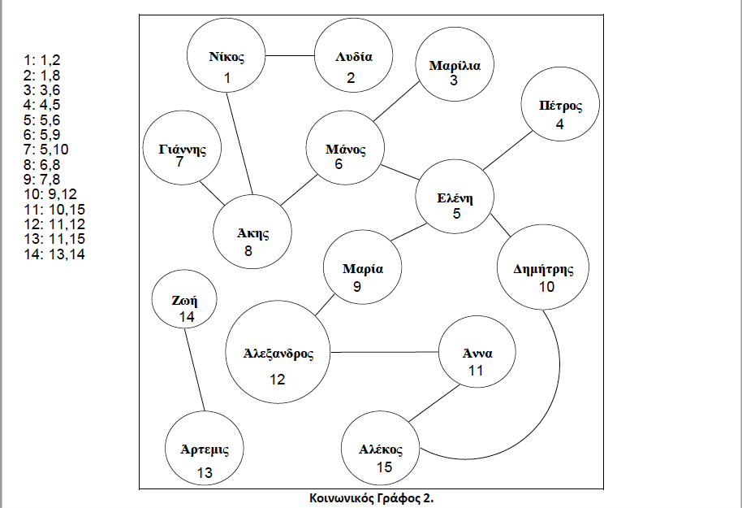

# Description of SocialFriends





We create the adjacency matrix  for the undirected graph Social Graph 2

details at:

https://thatdarndata.com/how-to-represent-an-undirected-graph-as-an-adjacency-matrix/


Array: 

```c
int GRAPH[NODES][NODES];
```


```shell
Incidence matrix of Graph:
 0 1 0 0 0 0 0 1 0 0 0 0 0 0 0
 1 0 0 0 0 0 0 0 0 0 0 0 0 0 0
 0 0 0 0 0 1 0 0 0 0 0 0 0 0 0
 0 0 0 0 1 0 0 0 0 0 0 0 0 0 0
 0 0 0 1 0 1 0 0 1 1 0 0 0 0 0
 0 0 1 0 1 0 0 1 0 0 0 0 0 0 0
 0 0 0 0 0 0 0 1 0 0 0 0 0 0 0
 1 0 0 0 0 1 1 0 0 0 0 0 0 0 0
 0 0 0 0 1 0 0 0 0 0 0 1 0 0 0
 0 0 0 0 1 0 0 0 0 0 0 0 0 0 1
 0 0 0 0 0 0 0 0 0 0 0 1 0 0 1
 0 0 0 0 0 0 0 0 1 0 1 0 0 0 0
 0 0 0 0 0 0 0 0 0 0 0 0 0 1 0
 0 0 0 0 0 0 0 0 0 0 0 0 1 0 0
 0 0 0 0 0 0 0 0 0 1 1 0 0 0 0
number of edges=28
```


We use a function to set 1 the item at array pos I-1,J-1 

when we have the edge/dislike I->J 

```
	// add 14 vertices from Social Graph 2
	addEdge(1, 2);
	addEdge(1, 8);
	addEdge(3, 6);
	addEdge(4, 5);
	addEdge(5, 6);
	addEdge(5, 9);
	addEdge(5, 10);
	addEdge(6, 8);
	addEdge(7, 8);
	addEdge(9, 12);
	addEdge(10, 15);
	addEdge(11, 12);
	addEdge(11, 15);
	addEdge(13, 14);
```


The scope is to find the maximum subset of Nodes 1..15 with no one dislike edge between nodes

explanation at:

https://en.wikipedia.org/wiki/Maximal_independent_set


Since we do not know yet many thinks about graphs

We have the starting set

1,2,3,4,5,6,7,8,9,10,11,12,13,14,15

we will create all subsets of above set with brute force

```c
	int r;

	for (r = NODES; r > 0; r--) {
		CalcCombinations(nodes, NODES, r);
		if (SizeOfMaxIndSet != 0) {
			// solution found so break brute force
			return SizeOfMaxIndSet;
		}
	}
	return SizeOfMaxIndSet;

```


CalcCombinations(notes,15) --> Subset with 15 elements

CalcCombinations(notes,14) --> Subset with 14 elements

**example**:

for r=15 we have just one subset

```
1 2 3 4 5 6 7 8 9 10 11 12 13 14 15
```

then we will check if we find one edge between the above nodes using the Array **GRAPH** 

one way to check is to create all pairs of above 15 items

```
1,2 1,3 1,4 ... 1,15
2,3 2,4 ... 2,15
...
14,15
```


using any easy algorihm for SubSet[] array with r=15 items 

```
	for (int i = 0; i < n; i++) {
		for (int j = i; j < n; j++) {
			if (i != j) {
				if (ADJ_MATRIX[SubSet[i] - 1][SubSet[j] - 1]) {
				// dislike edge exists
					return 1;
				}
			}
		}

 // no dislike edge exists for 
 return 0;

```


for r=14 we have many subsets

```
1 2 3 4 5 6 7 8 9 10 11 12 13 14
1 2 3 4 5 6 7 8 9 10 11 12 13 15
1 2 3 4 5 6 7 8 9 10 11 12 14 15
1 2 3 4 5 6 7 8 9 10 11 13 14 15
1 2 3 4 5 6 7 8 9 10 12 13 14 15
1 2 3 4 5 6 7 8 9 11 12 13 14 15
1 2 3 4 5 6 7 8 10 11 12 13 14 15
1 2 3 4 5 6 7 9 10 11 12 13 14 15
1 2 3 4 5 6 8 9 10 11 12 13 14 15
1 2 3 4 5 7 8 9 10 11 12 13 14 15
1 2 3 4 6 7 8 9 10 11 12 13 14 15
1 2 3 5 6 7 8 9 10 11 12 13 14 15
1 2 4 5 6 7 8 9 10 11 12 13 14 15
1 3 4 5 6 7 8 9 10 11 12 13 14 15
2 3 4 5 6 7 8 9 10 11 12 13 14 15
```


for r=13 we have even more

```
1 2 3 4 5 6 7 8 9 10 11 12 13
1 2 3 4 5 6 7 8 9 10 11 12 14
...
```


finally we found  8 subsets with 0 dislike relations/edge

```
Εναλλακτικό Σύνολο καλεσμένων-φίλων #1 :
1 3 4 7 9 10 11 13

Εναλλακτικό Σύνολο καλεσμένων-φίλων #2 :
1 3 4 7 9 10 11 14

Εναλλακτικό Σύνολο καλεσμένων-φίλων #3 :
1 4 6 7 9 10 11 13

Εναλλακτικό Σύνολο καλεσμένων-φίλων #4 :
1 4 6 7 9 10 11 14

Εναλλακτικό Σύνολο καλεσμένων-φίλων #5 :
2 3 4 7 9 10 11 13

Εναλλακτικό Σύνολο καλεσμένων-φίλων #6 :
2 3 4 7 9 10 11 14

Εναλλακτικό Σύνολο καλεσμένων-φίλων #7 :
2 3 4 8 9 10 11 13

Εναλλακτικό Σύνολο καλεσμένων-φίλων #8 :
2 3 4 8 9 10 11 14

Εναλλακτικό Σύνολο καλεσμένων-φίλων #9 :
2 4 6 7 9 10 11 13

Εναλλακτικό Σύνολο καλεσμένων-φίλων #10 :
2 4 6 7 9 10 11 14

```


we then print names instead of node numbers


```
Μέγιστος αριθμός καλεσμένων-φίλων στο Πάρτυ : 8

Εναλλακτικό Σύνολο καλεσμένων-φίλων #1 :
Νίκος Μαρίλια Πέτρος Γιάννης Μαρία Δημήτρης Άννα Άρτεμις

Εναλλακτικό Σύνολο καλεσμένων-φίλων #2 :
Νίκος Μαρίλια Πέτρος Γιάννης Μαρία Δημήτρης Άννα Ζωή

Εναλλακτικό Σύνολο καλεσμένων-φίλων #3 :
Νίκος Πέτρος Μάνος Γιάννης Μαρία Δημήτρης Άννα Άρτεμις

Εναλλακτικό Σύνολο καλεσμένων-φίλων #4 :
Νίκος Πέτρος Μάνος Γιάννης Μαρία Δημήτρης Άννα Ζωή

Εναλλακτικό Σύνολο καλεσμένων-φίλων #5 :
Λυδία Μαρίλια Πέτρος Γιάννης Μαρία Δημήτρης Άννα Άρτεμις

Εναλλακτικό Σύνολο καλεσμένων-φίλων #6 :
Λυδία Μαρίλια Πέτρος Γιάννης Μαρία Δημήτρης Άννα Ζωή

Εναλλακτικό Σύνολο καλεσμένων-φίλων #7 :
Λυδία Μαρίλια Πέτρος Άκης Μαρία Δημήτρης Άννα Άρτεμις

Εναλλακτικό Σύνολο καλεσμένων-φίλων #8 :
Λυδία Μαρίλια Πέτρος Άκης Μαρία Δημήτρης Άννα Ζωή

Εναλλακτικό Σύνολο καλεσμένων-φίλων #9 :
Λυδία Πέτρος Μάνος Γιάννης Μαρία Δημήτρης Άννα Άρτεμις

Εναλλακτικό Σύνολο καλεσμένων-φίλων #10 :
Λυδία Πέτρος Μάνος Γιάννης Μαρία Δημήτρης Άννα Ζωή
```

